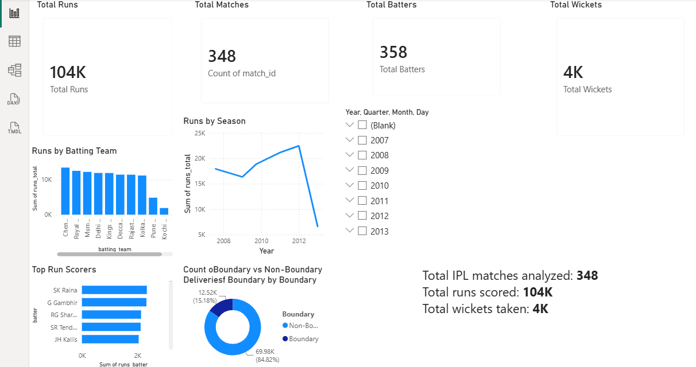
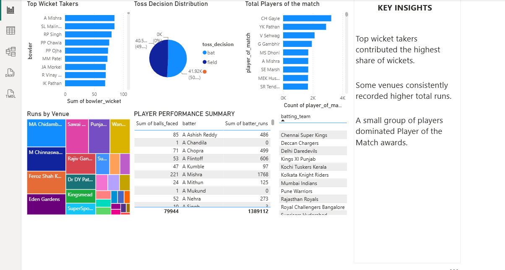

# BuildX-Analytics-ARJUN-T-N
# 🏏 IPL Data Analytics Dashboard

## 📌 Project Overview

This project is an end-to-end Data Analytics project completed as part of the **BuildX Data Analytics Bootcamp**. It demonstrates the complete analytics workflow by cleaning IPL data using Python, performing SQL-based business analysis, and building an interactive Power BI dashboard.

---

## 📂 Dataset Selected

**Dataset:** IPL Dataset (2008–2025)

This dataset contains ball-by-ball information for IPL matches, including batting, bowling, match details, venues, players, and results.

---

## 🎯 Why I Selected This Dataset

I selected the IPL dataset because cricket generates a large amount of structured data that is ideal for business analysis and visualization. It allowed me to explore player performance, team statistics, and match trends while applying Python, SQL, and Power BI skills in a real-world scenario.

---

## ❓ Business Questions Answered

1. Which batting teams scored the highest total runs?
2. Who are the top run scorers in IPL history?
3. How are runs distributed across different IPL seasons?

---

## 🛠️ Tools Used

- Python (Pandas)
- Google Colab
- SQLite
- Power BI Desktop
- GitHub

---

## 📊 Dashboard Features

- Python Data Cleaning
- SQL Business Analysis
- Interactive Power BI Dashboard
- DAX Measure
- DAX Calculated Column
- KPI Cards
- Charts and Visualizations
- Season Slicer
- Page-Level Filters

---

## 💡 Key Insight

The analysis shows that a small number of players contribute a significant share of total runs, while a few batting teams consistently dominate scoring across multiple IPL seasons.

---

## 📷 Dashboard Screenshots

### Player & Match Analysis

---

## 📁 Project Files

- `notebook.ipynb`
- `cleaned_dataset.csv`
- `queries.sql`
- `dashboard.pbix`
- `README.md`

---

## 👨‍💻 Author

**Arjun T N**

B.Tech Computer Science Engineering

BuildX Data Analytics Bootcamp
